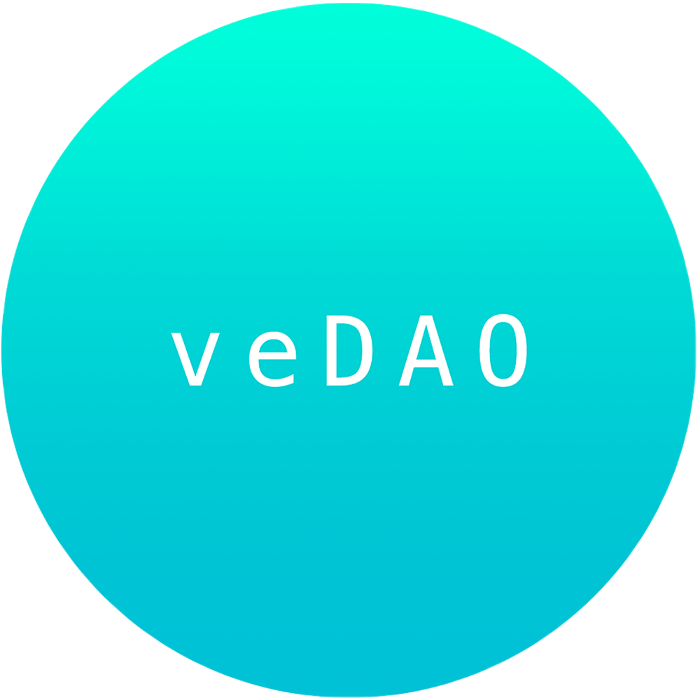

<div align="center">

</div>

# veRICKS are RICKS from another dimension.

| Protocol | Fractionalization | Inflation mechanism | Buybacks | Purchase | Shard Rewards |
| --- | :---: | :---: | :---: | --- | :---: |
| RICKS  | ✅ | ✅ | ✅ | Buy NFTs with Ether. | ❌ | 
| veRICKS  | ✅ | ✅ | ✅ | Buy NFTs with ve(3,3) `token` | Shard rewards for staking with the veRICKS protocol on auctions after genesis |

# The veRICKS Protocol fractionalizes an NFT (ERC-721) into shards (ERC-20). 

After this initial fractionalizing, the "voter escrow" Recurrently Issued Collectively Kept Shards (veRICKS) Protocol will continually mint new shards on a schedule and auction them to the public. The proceeds of these auctions are distributed to veRICKS (shard) holders.

#### Q: Where does a veRICKS auction take place? 

A user bids on a veRICKS auction via a smart contract call on Fantom. This is the [veRICKS](../contracts/veRICKS.sol) contract. People buy the shards with Solidly `token`. Users have two avenues by which they can get `token` to purchase shards. 
  - Option 1: Users can provide liquidity on Fantom in a Solidly-compatible pool (BaseV1Pair), stake their LP tokens on that pool, and get `token` from the Solidly Protocol.
  - Option 2: Since `token` (ERC-20) is transferable, it will have liquidity on some DEX, meaning the veRICKS user could buy `token` on an exchange without providing liquidity. 

**Note**, an individual selling shards does so on a DEX. The veRICKS protocol is the only entity that sells shards via auction.

# veRICKS Protocol ensures shards can be converted back into the corresponding NFT.


---

## References/Acknowledgements

veRICKS is a spork (special fork) of the implementation of [RICKS][paradigm-ricks] made by [@FrankieIsLost][FrankieTwitter]. 
- [@FrankieIsLost][FrankieTwitter]
-  [RICKS repo][RICKS-repo]
- [@_Dave__White_][daveWhiteTwitter], [@andy8052][andy8052Twitter] and [@danrobinson][danRobinsonTwitter]. 

> "RICKS aims to solve the reconstitution problem -- how do we design a fractionalization mechanism that ensures a pathway to recovering the underlying asset?"

[paradigm-ricks]: https://www.paradigm.xyz/2021/10/ricks/
[daveWhiteTwitter]: https://twitter.com/_Dave__White_
[andy8052Twitter]: https://twitter.com/andy8052
[danRobinsonTwitter]: https://twitter.com/danrobinson
[RICKS-repo]: https://github.com/FrankieIsLost/RICKS
[FrankieTwitter]: https://twitter.com/FrankieIsLost

*Disclaimer: This content is provided for informational purposes only, and should not be relied upon as legal, business, investment, or tax advice. You should consult your own advisers as to those matters. References to any securities or digital assets are for illustrative purposes only, and do not constitute an investment recommendation or offer to provide investment advisory services. This content is not directed at nor intended for use by any investors or prospective investors, and may not under any circumstances be relied upon when making investment decisions.*

--- 

# RICKS README

## Implementation Notes

There are a few differences between the present implementation and the original mechanism design: 

### The Buyout 

The original paper proposes a lottery buyout. When a majority owner triggers the buyout mechanism, they initiate a coin flip. With a 50% chance, they win all outstanding shares. And with a 50% chance, they pay every other owner the amount of shares required to double their positions. While this is EV fair, it has a few problems. Minority owners might feel like they were not properly compensated for their RICKS in the event of a loss, and majority owners might be reluctant to trigger the process given risk-aversion. 

This implementation uses a deterministic buyout process, which works as follows: First, the average price per shard of the past 5 buyouts is used to determine an implied valuation. Then, to trigger a buyout, an interested party must pay other owners a premium above this implied valuation. The premium scales quadratically with the unowned supply of RICKS, to disuade buyouts from minority owners. There's a lot of room to tune the premium function here. After the buyout process is completed, remaining shard holders are able to redeem those shards for their payout. 

### The Auction 

This implementation uses an on-demand auction system, where anyone can trigger an auction given a certain minimum amount of time has elapsed since the last auction. The amout of shards issued is based on the amount of time elapsed between auctions, and is tunable through an inflation rate parameter. 

### Staking

The RICKS contract deploys a staking pool on creation. Proceeds of the auction are paid to the staking pool. Any owner of RICKS can stake their shards in the pool. Proceeds from the auction are paid proportionally by staking weight at time of distribution into the pool. Staking pool implementation is based on [Scalable Reward Distribution on the Ethereum Blockchain](https://uploads-ssl.webflow.com/5ad71ffeb79acc67c8bcdaba/5ad8d1193a40977462982470_scalable-reward-distribution-paper.pdf)

## How to run 

You'll need to add your alchemy key in `hardhat.config.js` in order to run tests against forked mainnet. After that, run: 

```bash
# Install dependencies
npm install

# test contracts with hardhat
npx hardhat test
```


```
⠀⠀⠀⠀⠀⠀⠀⠀⠀⠀⠀⠀⠀⠀⠀⠀⠀⠀⠀⠀⠀⠀⢀⡤⠶⢶⣶⣦⣄⡀⠀⠀
⠀⠀⠀⠀⠀⠀⠀⠀⠀⠀⠀⠀⠀⠀⠀⠀⠀⠀⠀⠀⠀⣠⣾⣿⡄⠒⠪⢝⠻⣿⣿⣦⡀
⠀⠀⠀⠀⠀⠀⠀⠀⠀⠀⠀⠀⠀⠀⠀⠀⠀⠀⠀⠀⣴⣿⡿⢉⡀⠀⠈⠐⠄⢿⣿⣿⣷
⠀⠀⠀⠀⠀⠀⠀⠀⠀⠀⠀⠀⠀⠀⠀⠀⠀⠀⠀⣼⣿⡇⠀⠀⠈⡄⠤⢀⠈⣾⣿⣿⣿
⠀⠀⠀⠀⠀⠀⠀⠀⠀⠀⠀⠀⠀⠀⠀⠀⠀⢀⡾⣿⣟⣕⡤⡠⠘⠀⠀⠀⢱⣿⣿⣿⣿
⠀⠀⠀⠀⠀⠀⠀⠀⠀⠀⠀⠀⠀⠀⠀⠀⢠⣾⣾⣿⣞⣄⠮⠔⠈⡢⠄⣠⣾⣿⣿⣿⣿
⠀⠀⠀⠀⠀⠀⠀⠀⠀⠀⠀⠀⠀⠀⠀⠠⢿⣿⢽⡻⣿⣿⣿⣽⣵⣾⡽⣿⣿⣿⣿⣿⡏
⠀⠀⠀⠀⠀⠀⠀⠀⠀⠀⠀⠀⠀⠀⢠⣗⣿⡟⠈⠉⠚⢽⣻⢷⡝⣿⡿⣿⣿⣿⣿⡿⠀
⠀⠀⠀⠀⠀⠀⠀⠀⠀⠀⠀⠀⠀⢠⣿⣿⣿⠇⠀⠀⠀⠀⠀⢩⣯⣭⣾⣿⣿⣿⣿⠁⠀
⠀⠀⠀⠀⠀⠀⠀⠀⠀⠀⠀⠀⣰⣿⣿⣿⠃⠀⠀⠀⠀⠀⣰⣿⣿⣿⣿⣿⣿⣿⠃⠀⠀
⠀⠀⠀⠀⠀⠀⠀⠀⠀⠀⠀⣴⣿⣿⡿⠃⠀⠀⠀⠀⣠⣼⣿⣿⣿⣿⣿⣿⣿⠃⠀⠀⠀
⠀⠀⠀⠀⠀⠀⠀⠀⠀⢀⢞⣿⣿⡿⠁⠀⠀⠀⣠⣾⣿⣿⣿⣿⣿⣿⣿⣿⠃⠀⠀⠀⠀
⠀⠀⠀⠀⠀⠀⠀⠀⣰⣿⣾⣿⠏⠀⠀⠀⠀⣾⣿⣿⣿⣿⣿⣿⡟⣿⣿⠏⠀⠀⠀⠀⠀
⠀⠀⠀⠀⠀⠀⣠⣾⣿⣿⣿⠃⠀⠀⠀⠀⣸⣿⣿⣿⣿⣿⣟⣷⣾⣿⠏⠀⠀⠀⠀⠀⠀
⠀⠀⠀⠀⢀⣾⣿⣿⣿⣿⠃⠀⠀⠀⢀⣴⣿⣿⣿⣿⣿⣿⣿⣿⣿⠋⠀⠀⠀⠀⠀⠀⠀
⠀⠀⠀⡰⢿⣿⣿⣯⡶⠁⠀⠀⢀⣴⣿⣿⣿⣿⣿⣿⣿⣿⣿⡿⠃⠀⠀⠀⠀⠀⠀⠀⠀
⠀⢀⣼⣟⣿⣿⡿⠃⠀⠀⢀⣴⣿⣿⣿⣿⣿⣿⣿⣿⣿⣿⡟⠁⠀⠀⠀⠀⠀⠀⠀⠀⠀
⢀⣾⣿⣿⡯⣿⠀⠀⢠⣴⣿⣿⣿⣿⣿⣿⣿⣿⣿⣿⣿⠏⠀⠀⠀⠀⠀⠀⠀⠀⠀⠀⠀⠀⠀
⣾⣿⣿⣿⣿⣿⣶⣶⣿⣿⣿⣿⣿⣿⣿⣿⣿⣿⣿⡿⠁⠀⠀⠀⠀⠀⠀⠀⠀⠀⠀⠀⠀
⠿⣿⡿⣿⣿⣿⣿⣿⣿⣿⣿⣿⣿⣿⣿⣿⢿⡿⠋⠀⠀⠀⠀⠀⠀⠀⠀⠀⠀⠀⠀⠀⠀
⠀⠛⠀⠈⠀⠻⣿⣿⣿⣿⣿⣟⣛⣿⣿⡭⠋⠀⠀⠀⠀⠀⠀⠀⠀⠀⠀⠀⠀⠀⠀⠀⠀
⠢⡀⠀⠀⠀⠀⠻⣿⣿⣿⣿⣿⣭⠟⠉⠀⠀⠀⠀⠀⠀⠀⠀⠀⠀⠀⠀⠀⠀⠀⠀⠀⠀
⠀⠈⠐⠤⢀⡀⠀⢀⣙⣿⠿⠋⠁⠀⠀⠀⠀⠀⠀⠀⠀⠀⠀⠀⠀⠀⠀⠀⠀⠀⠀⠀⠀
```
